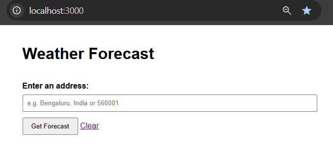
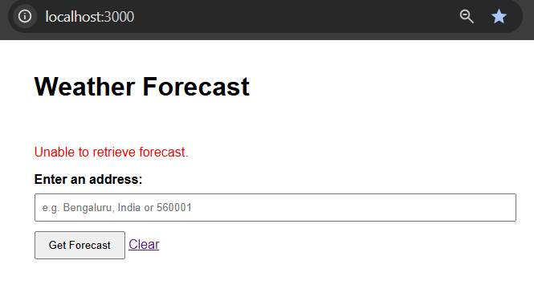
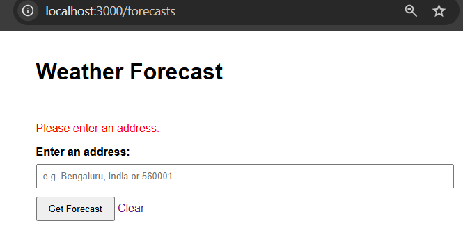
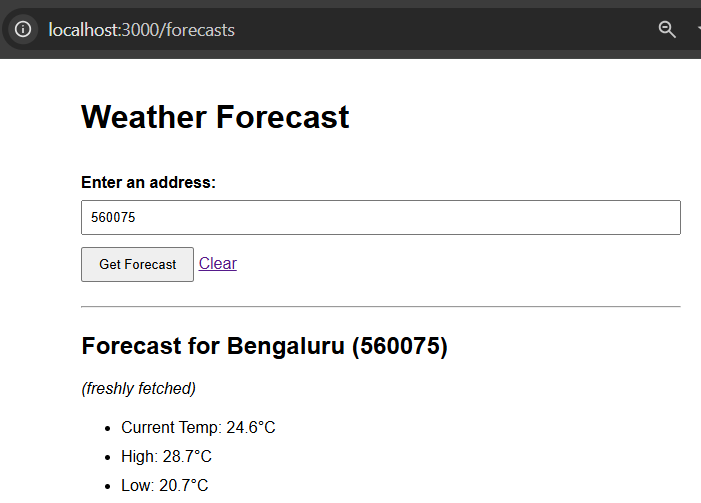
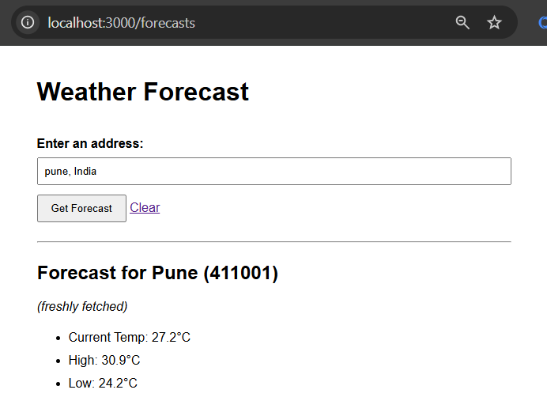
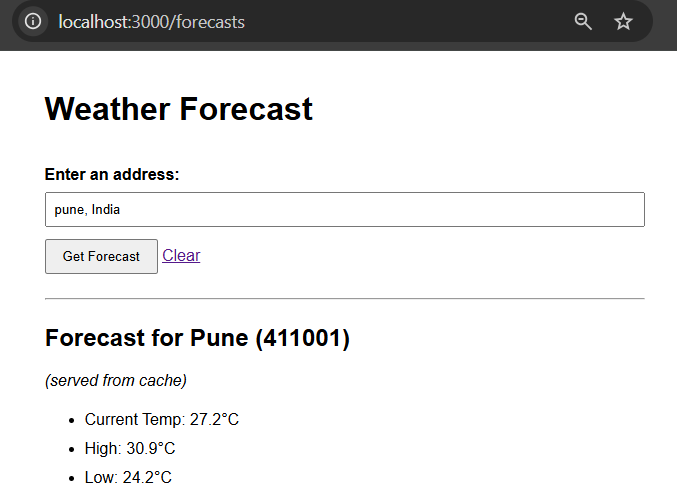

# Weather Forecaster

A Ruby on Rails application that accepts an address or postal code, retrieves weather information for the corresponding location, and caches forecast responses for 30 minutes.

---

## Features

- Accepts an address or zip/postal code as input.
- Retrieves geographic coordinates using OpenStreetMap Nominatim.
- Retrieves current temperature and daily high/low values using Open-Meteo.
- Caches forecast responses for 30 minutes.
- Indicates whether a response was served from cache.
- Handles invalid addresses and API failures gracefully.
- Includes automated test coverage using RSpec.

---

## Screenshots

### Home Page



### Invalid Address



### Blank Address



### Forecast Using Postal Code



### Forecast Using Address



### Cached Response



## Requirements

- Ruby 3.x
- Rails 7.x
- SQLite
- Bundler

---

## Setup

Clone the repository:

```bash
git clone <repository-url>
cd weather_forecaster
```

Install dependencies:

```bash
bundle install
```

Create the database:

```bash
bin/rails db:create
```

Start the application:

```bash
bin/rails server
```

Visit:

```text
http://localhost:3000
```

---

## Running Tests

Execute:

```bash
bundle exec rspec
```

---

## Application Flow

```text
User Input
     ↓
ForecastsController
     ↓
ForecastService
     ↓
GeocodingService
     ↓
WeatherService
```

---

## Object Decomposition

### ForecastsController

Responsible only for:

- Receiving user input.
- Delegating business logic.
- Rendering responses.

### ForecastService

Responsible for:

- Orchestrating the workflow.
- Combining location and weather information.
- Managing caching.

### GeocodingService

Responsible for:

- Converting an address into coordinates.
- Extracting city and postal code information.

### WeatherService

Responsible for:

- Retrieving weather data from Open-Meteo.

---

## External APIs

### OpenStreetMap Nominatim

Used for:

```text
Address → Coordinates
```

### Open-Meteo

Used for:

```text
Coordinates → Weather Forecast
```

---

## Caching Strategy

Forecast data is cached for 30 minutes.

Cache key priority:

1. Postal code (preferred)
2. Latitude + longitude fallback

Examples:

```text
forecast:600001
forecast:13.0827:80.2707
```

This prevents different locations without postal codes from sharing the same cache entry.

---

## Error Handling

The application gracefully handles:

- Blank input.
- Invalid addresses.
- Geocoding failures.
- Weather API failures.

User-friendly messages are displayed when forecast data cannot be retrieved.

---

## Design Patterns Used

### Service Object Pattern

Business logic is extracted from controllers into dedicated service classes.

Benefits:

- Improved readability.
- Better separation of concerns.
- Easier testing.

### Thin Controller Pattern

Controllers remain focused on HTTP concerns while business logic resides in service objects.

### Composition

ForecastService composes multiple services to build the final response.

---

## SOLID Principles Applied

### Single Responsibility Principle (SRP)

Each class has one responsibility:

- GeocodingService → Address lookup.
- WeatherService → Weather retrieval.
- ForecastService → Workflow orchestration and caching.

### Open/Closed Principle (OCP)

External integrations are isolated behind service objects, making it easy to replace providers without impacting the controller.

### Dependency Isolation

External APIs are encapsulated and can be mocked independently during testing.

---

## Scalability Considerations

- Forecast responses are cached to reduce unnecessary API calls.
- External dependencies are isolated behind service objects.
- Additional weather providers can be introduced with minimal changes.
- Extended forecasts can be added without changing controller logic.

---

## Assumptions

- Current temperature and daily high/low values are sufficient for this exercise.
- Forecast data is cached for 30 minutes as required.
- Functionality is prioritized over UI styling.

---
